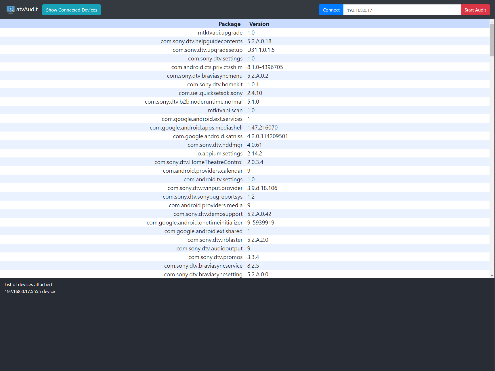

# atvAudit
This is a fullstack web application that scans an Android device for all the packages currently installed in it and will highlight the application/s that had an update compared to the last time the atvAuto last scanned the same device device.

*Note¹: atvAudit needs an initial scan, meaning the first time atvAudit scans an Android device will will highlight all packages because there was no data saved for that device yet.*

*Note²: Since this is a fullstack web application, you will need to setup a server to use it, I recommend using a local server with your LAN so that you know all the device connected to the network.*

## How to setup local server:

### Requirements:
1. `Android Debug Bridge (ADB)` is installed on the machine/server that you will use, and is in the Environment PATH. This script uses adb commands to audit an Android device.
2. `Node.js` is installed and also in Environment PATH, the server is made using `Express.js`

### Download and Setup Node.js server:
1. Download or clone this repository
2. Open the command prompt(windows) or terminal(Mac) within the root directory of this repository. (where the `server.js` is).
3. Install all the modules required with the command `npm install`
    - this command create a folder called `node_modules` within the root directory of this repository, you only need to do this once.
4. After the download finished you can start the server with the command `npm start`
    - this command will open your default browser, if not you can manually open your browser (chrome preffered) then navigate to `http://localhost:3000`.
    - once the server is running, any device connected to the same network as the server will be able to use the script, just open up the browser then go to `server's-local-IP-address:3000`, (Mobile friendly)

## How to use the Web App:

There are 3 buttons on the top;
- `Show Connected Device` - this will besically the `adb devices` command, what it does is start the adb server if it is not already and then print out a list in the buttom part of the screen all the connected devices in your server. (see image below)
- `Connect` - if you don't see your device in the device list, enter the device's IP address in the textbox next to the `connect` button then press connect to connet that device. (IP address only, do not include port number)
- `Start Audit` - enter the device's IP address in the textbox then press `Start Audit` to start the script. (IP address only, do not include port number), the package list will show in the middle part of the screen. all apps updated will be highlighted in red. (read *Note¹*)

